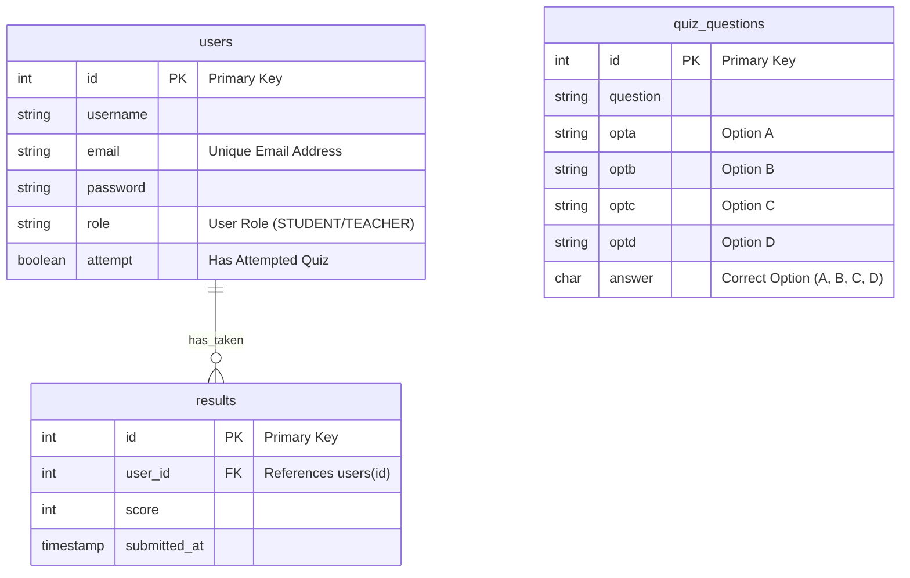

# Angular-Quiz-App
## My Project Description
This project implements a comprehensive Quiz Management System with a Spring Boot backend and an Angular frontend. It provides functionalities for both administrators and students to manage quizzes, take exams, and view results. The system is designed to be robust, user-friendly, and efficient for educational environments.

---

## Features

### User Management
-   **User Registration:** New users can sign up for an account.
-   **User Login:** Registered users can log in with their credentials.
-   **Role-Based Access Control:** Differentiates between `ADMIN` and `STUDENT` roles, providing specific access to functionalities.
-   **Logout:** Users can securely log out of their sessions.

### Admin Features
-   **Admin Dashboard:** Overview for administrators to navigate through various management sections.
-   **Quiz Management:**
    -   **View Quizzes:** List all available quiz questions with pagination and search functionality.
    -   **Add Quiz:** Create new quiz questions with multiple-choice options and a correct answer.
    -   **Edit Quiz:** Update existing quiz questions.
    -   **Delete Quiz:** Remove quiz questions from the system.
-   **Student Management:** View a list of all registered students.
-   **Result Management:** View all submitted quiz results by students.

### Student Features
-   **Student Dashboard:** Landing page for students, displaying available quizzes.
-   **Take Quiz:** Participate in quizzes with a timer and question navigation.
-   **View Results:** See detailed scores and feedback after completing a quiz.

---

## Technologies Used

### Frontend (Angular)
-   **TypeScript**
-   **HTML5 & CSS3**
-   **JS**
-   **Angular Router**

### Backend (Spring Boot)
-   **Java**
-   **Spring Boot**
-   **PostgreSQL**
-   **Maven**
-   **RESTful APIs**

---

## Database Tables

The database schema includes the following tables:

-   **`users`**: Stores user authentication and profile information.
    -   `id`: Primary key, auto-incrementing.
    -   `username`: User's display name.
    -   `email`: Unique email address for login.
    -   `password`: Hashed password.
    -   `role`: User's role (`STUDENT` or `TEACHER`).
    -   `attempt`: Boolean indicating if the user has attempted a quiz.

-   **`quiz_questions`**: Stores individual quiz questions and their options.
    -   `id`: Primary key, auto-incrementing.
    -   `question`: The text of the quiz question.
    -   `opta`, `optb`, `optc`, `optd`: Text for the four multiple-choice options.
    -   `answer`: The correct option (A, B, C, or D).

-   **`results`**: Stores the outcome of each quiz attempt by a user.
    -   `id`: Primary key, auto-incrementing.
    -   `user_id`: Foreign key referencing the `users` table.
    -   `score`: The score obtained in the quiz.
    -   `submitted_at`: Timestamp of when the result was submitted.

---

## Entity-Relationship (ER) Diagram

---

## Pages/Routes

The Angular frontend defines the following main routes:

-   `/login`: User login page.
-   `/signup`: User registration page.
-   `/admin-dashboard`: Main dashboard for administrators.
-   `/student-dashboard`: Main dashboard for students.
-   `/quiz`: Page for taking a quiz.
-   `/result`: Page to display quiz results.
-   `/quiz-list`: Admin page to view and manage all quizzes.
-   `/student-list`: Admin page to view all registered students.
-   `/result-list`: Admin page to view all quiz results.
-   `/add-quiz`: Admin page to add a new quiz question.
-   `/edit-quiz/:id`: Admin page to edit an existing quiz question (where `:id` is the quiz ID).

---

## Group Members
### Programmer(DB, Front end, Back end): (Group Leader)

- Name: Abdul Nabi Sheeraz
- Phone: 9022009241
- Email: sheeraz842122@gmail.com

### Superwiser:

- Name: Jaywanta Kawale
- Phone: 7028089058
- Email: jaywanta98@gmail.com

### Github Manager:

- Name: Shaikh Masum 
- Phone: 8830597819
- Email: shaikhmasum319051@gmail.com

### Debugger:

- Name: Pathan Faizan
- Phone: 8767025292
- Email: pathanfaizan8767@gmail.com

### CSS:

- Name: Abdul Muqtasid
- Phone: 7410717151
- Email: amuqsit279@gmail.com
